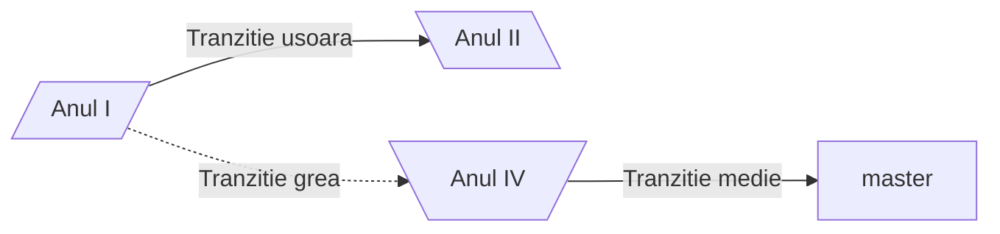

<script id="MathJax-script" async src="https://cdn.jsdelivr.net/npm/mathjax@3/es5/tex-mml-chtml.js"></script>


[homepage](index.md)  

# Diagrame de tip _flowchart_

```



**De retinut**
- Diagramele _flowchart_
- Nodurile au :
  - **forma** (data de parantezele folosite la descrierea _nodului_)
  - ID (sirul folosit in afara descrierii nodului)
  - Descrierea (textul e apare in caseta nodului si care este implementat in interiorul diferitelor tipuri de paranteze - ce decid forma casetei nodului)

- Conectorii au:
  - Diferite tipuri de sageti sau chiar pot activa fara sageti
  - Diferite tipuri de linii:
    - ` >` linie continua (sageata dreapta)
    - `-` linie continua (fara sageti)
    - `<->` linie continua (sageata stanga si sageata dreapta)
    -  `->` linie ingrosata cu sageata spre dreapta
 


## Diagrame _flowchart_ avansate

```mermaid
